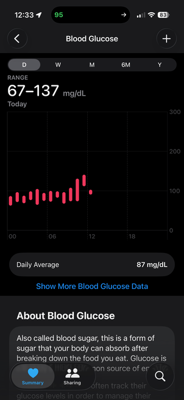
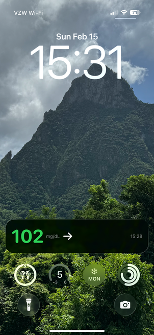
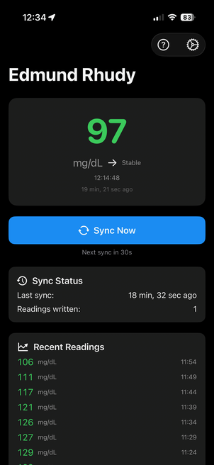

# LibreHealthSync

LibreHealthSync is a small app I created to fill in a couple of feature gaps in Abbott's official app, namely writing blood glucose data to HealthKit, and providing a Live Activity widget that periodically updates. These features were borrowed from [GlucoseDirect](https://github.com/creepymonster/GlucoseDirect), but this app works alongside the regular Abbott app instead of attempting to replace it.

## Caveats

* The app does not directly link with the CGM or the app on your device, but instead reads it from Abbott's LibreLinkUp API, so you need to have already configured LibreLinkUp or LibreView or whatever Abbott calls it and be uploading your readings.
* I live in the United States and so I disabled all the other API endpoints because I have no way of testing them. I also didn't check whether mmol/L units work as expected. If you live elsewhere and have the know-how and wherewithal to build this yourself and test it against your country's API endpoint, and it works, by all means please submit a PR to enable it.
* The app is subject to iOS's funkety constraints on background activities, so the live activity will not update as frequently as you think it should. In my experience it tends to update every 10-15 minutes.
* The app has a settings toggle to enable more aggressive polling, but this will keelhaul your battery life and still not make the Live Activity widget update any faster. I don't recommend enabling it.
* Sometimes data processing is delayed on Abbott's side and readings do not show up promptly in the LLU responses. Even at the best of times, readings will be a couple of minutes behind.
* I am an SRE manager and know how to write code, but not in Swift and not for mobile devices, so this was mostly vibe coded with Claude. Almost definitely some of the weirdness with the Live Activity is because I don't know what I'm doing and neither does the fancy codin' robot.

## Screenshots

  

## Disclaimers

**Unofficial API:** This app uses an unofficial, reverse-engineered Abbott LibreLinkUp API. It is not affiliated with, endorsed by, or supported by Abbott Laboratories. The API may change or stop working at any time without notice.

**Not a Medical Device:** This app is not a medical device and must not be used to make medical decisions. Always rely on your official glucose monitor and consult your healthcare provider for medical guidance.

**No Warranty:** This app is provided "as is" without warranty of any kind. The developer assumes no liability for any damages or issues arising from its use.

**Data & Credentials:** Your LibreLinkUp credentials are stored locally in the iOS Keychain on your device. Glucose data is transmitted to and from Abbott's servers as part of the normal LibreLinkUp API flow.

**Use at Your Own Risk:** By using this application, you acknowledge that you understand and accept the risks associated with using this unofficial application.

## Attributions

_The icon for this app is from [Blood icons created by srip](https://www.flaticon.com/free-icons/blood). I might make an actual icon someday._
